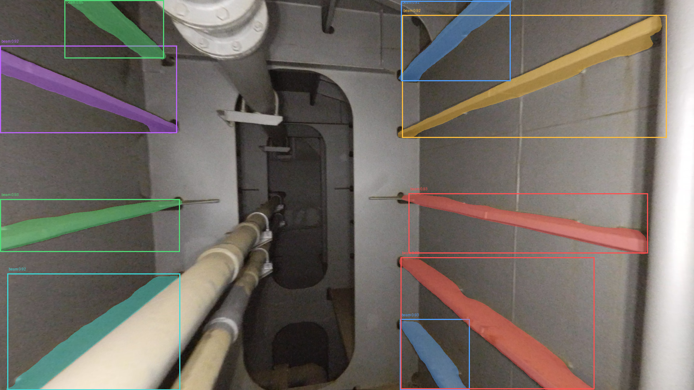

# RF-DETR Based Instance Segmentation Package

This package provides tools for **RF-DETR-based instance segmentation**, including dataset preparation, model training, inference, and result management.

The current implementation uses **RF-DETR Small in instance segmentation mode**.

## Example Result



---

## Installation

### Install `uv`

Install `uv` following the instructions from:

https://github.com/astral-sh/uv

For Linux:

```console
curl -LsSf https://astral.sh/uv/install.sh | sh
```

Make sure `uv` is available in your `PATH`:

```console
echo 'export PATH="$HOME/.local/bin:$PATH"' >> ~/.bashrc
source ~/.bashrc
```

### Install Python 3.12

```console
uv python install 3.12
```

To see the available Python versions:

```console
uv python list
```

Create the virtual environment:

```console
uv venv .venv-deploy -p 3.12
```

Activate it:

```console
source .venv-deploy/bin/activate
```

### Install PyTorch

The tested configuration uses PyTorch with CUDA 12.8:

```console
uv pip install torch==2.10.0 torchvision==0.25.0 torchaudio==2.10.0 \
    --index-url https://download.pytorch.org/whl/cu128
```

### Install this package

From the root of the `instance_segmentation` repository:

```console
cd instance_segmentation
uv pip install -e .
```

### Install RF-DETR

Clone the RF-DETR repository:

```console
git clone https://github.com/roboflow/rf-detr.git
cd rf-detr
uv pip install -e .
```

For training-related dependencies:

```console
uv pip install -e ".[train,loggers]"
```

The RF-DETR version used and tested with this project is:

```text
rfdetr 1.8.0
```

### Additional packages

Install `supervision` when required:

```console
uv pip install supervision
```

To add another package to the currently active environment:

```console
uv add --active <PACKAGE_NAME>
```

### Environment management

List installed packages:

```console
uv pip list
```

Export the current environment:

```console
uv pip freeze > all-deps.txt
```

After manually removing packages that should not be included:

```console
mv all-deps.txt deploy-requirements.in
```

Compile the requirements lock file:

```console
uv pip compile -o deploy-requirements.lock deploy-requirements.in
```

To remove the virtual environment:

```console
rm -rf .venv-deploy
```

---

# Dataset Preparation

The dataset preparation script converts the source annotations and images into the format required by RF-DETR.

For the initial experiment, the dataset is split into:

* **9 images for training**
* **1 image for validation**

This is a simple train/validation split and is **not yet k-fold cross-validation**.

Run:

```console
python src/instance_segmentation/database/prepare_rfdetr_dataset.py \
    --annotations <DB_PATH>/annotated/annotations.json \
    --images_dir <DB_PATH>/annotated/frames \
    --output_dir <DB_PATH>/rf_detr_format \
    --val_count 1 \
    --seed 42
```

The script creates separate training and validation subsets with the corresponding RF-DETR/COCO annotation files:

```text
<DB_PATH>/rf_detr_format/
├── train/
│   ├── _annotations.coco.json
│   └── <training images>
└── valid/
    ├── _annotations.coco.json
    └── <validation image>
```

---

# Model Training

Train the RF-DETR Small instance-segmentation model:

```console
python src/instance_segmentation/script/rf_detr/rf_detr_instance_segmentation_train.py \
    --dataset_dir <DB_PATH>/rf_detr_format \
    --output_dir <OUTPUT_DIR>
```

The script trains the model on the training subset and evaluates it on the validation subset while saving checkpoints, logs, and training results to `<OUTPUT_DIR>`.

The best model checkpoint is:

```text
<OUTPUT_DIR>/checkpoint_best_total.pth
```

This checkpoint can then be used for inference.

---

# Inference

Run inference on new, unannotated images using the selected model checkpoint:

```console
python src/instance_segmentation/script/rf_detr/inference.py \
    --model_weights <OUTPUT_DIR>/checkpoint_best_total.pth \
    --context_dir <DB_PATH>/annotated \
    --predict_dir <DB_PATH>/unannotated/frames \
    --output_json <OUTPUT_DIR>/test_set/predictions.json \
    --confidence 0.5 \
    --save_overlay
```

### Inputs

`--model_weights`
Path to the trained RF-DETR Small model checkpoint.

`--context_dir`
Directory containing the reference annotation JSON and dataset information used to obtain the category definitions and image metadata.

`--predict_dir`
Directory containing the images to be processed.

`--output_json`
Path where the prediction JSON file will be saved.

`--confidence`
Minimum detection confidence threshold. For example, `0.5` keeps detections with confidence ≥ 0.5.

`--save_overlay`
Saves visualization images with predicted masks, bounding boxes, class labels, and confidence scores.

To additionally save individual binary instance masks:

```console
--save_masks
```

Both can be enabled together:

```console
--save_masks --save_overlay
```

## Example Experiment

A complete example workflow is provided in [`run_beam_segmentation.sh`](src/instance_segmentation/script/rf_detr/run_beam_segmentation.sh). The script prepares the dataset, trains the RF-DETR Small instance-segmentation model, and runs inference on unannotated images using the best model checkpoint. Set `DB_PATH` at the beginning of the script to point to your dataset directory, then run:

```console
bash src/instance_segmentation/script/rf_detr/run_beam_segmentation.sh
```

The script provides a simple end-to-end example that can be adapted to a new dataset by changing the input and output paths.

---

# Inference Output

The inference script produces the prediction JSON file and, optionally, visualization and binary mask images.

Example:

```text
<OUTPUT_DIR>/test_set/
├── predictions.json
├── overlay/
│   ├── image_001.png
│   └── ...
└── masks/
    ├── image_001_obj_000.png
    └── ...
```

The `overlay/` directory is created when `--save_overlay` is specified.

The `masks/` directory is created when `--save_masks` is specified.

---

# Example Workflow

```text
Source dataset
     │
     ▼
prepare_rfdetr_dataset.py
     │
     ├── train/
     └── valid/
     │
     ▼
rf_detr_instance_segmentation_train.py
     │
     ▼
checkpoint_best_total.pth
     │
     ▼
inference.py
     │
     ├── predictions.json
     ├── overlay/
     └── masks/
```

The same inference script can be used on new, unannotated datasets after training.
